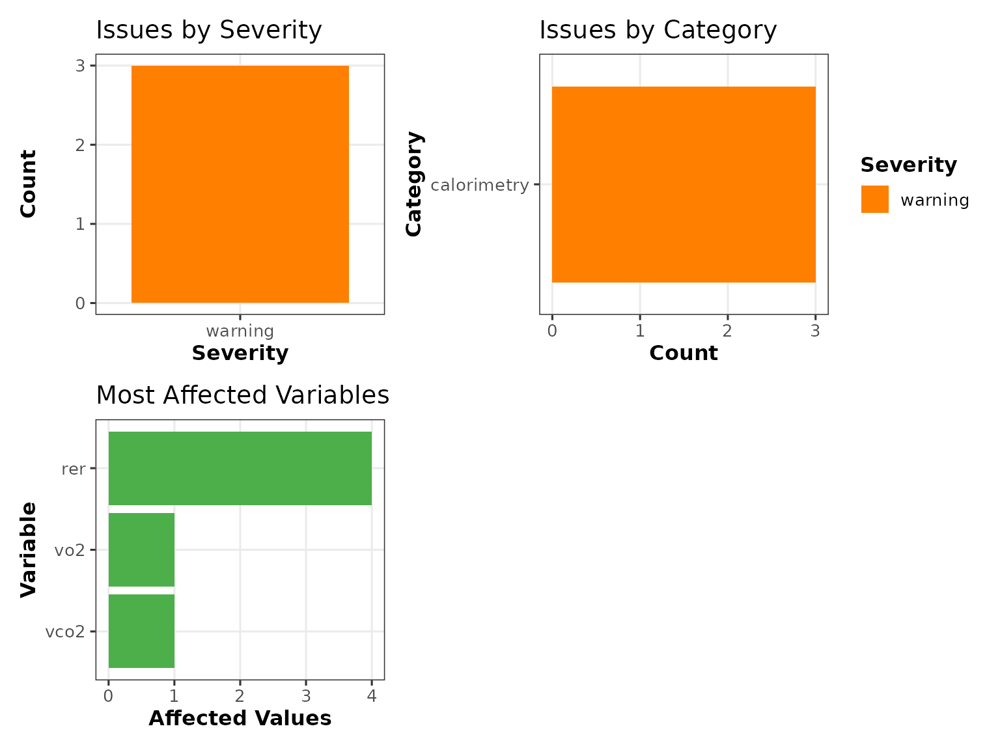
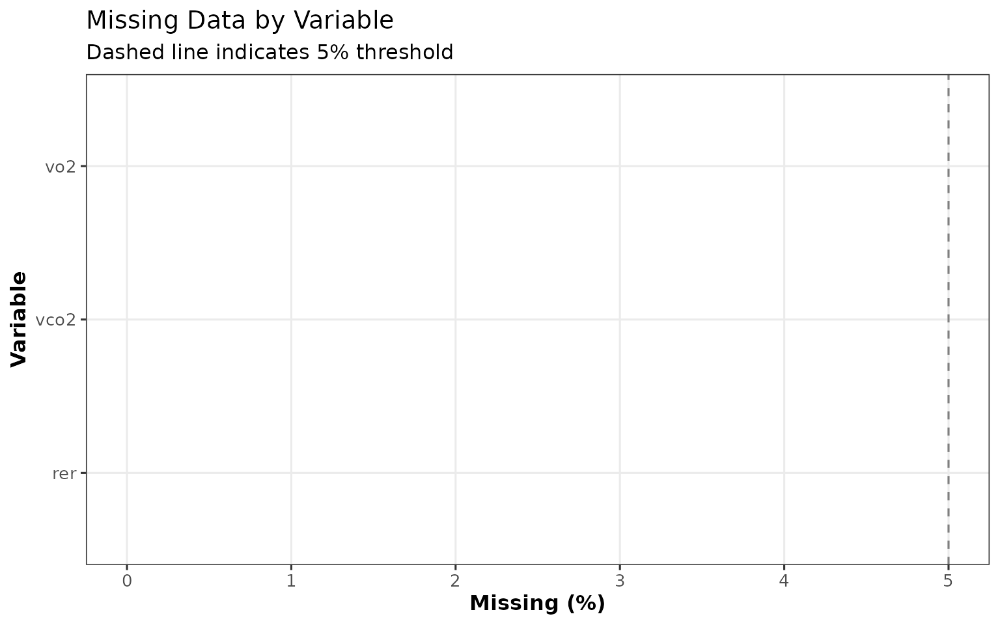
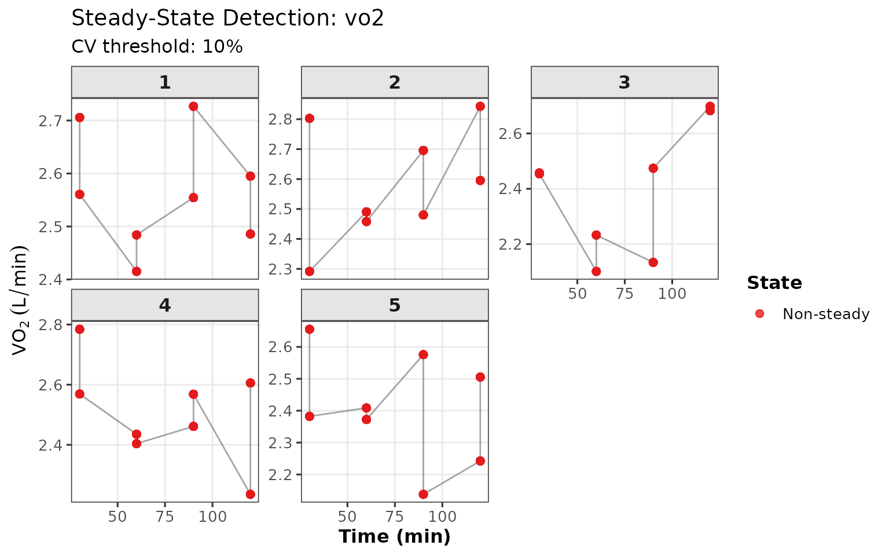
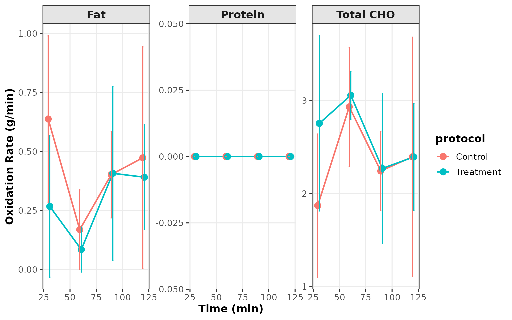
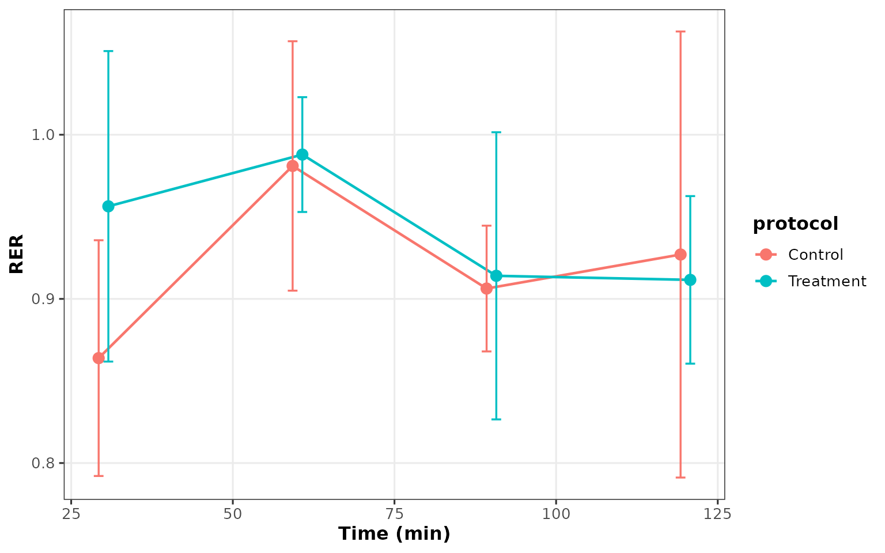
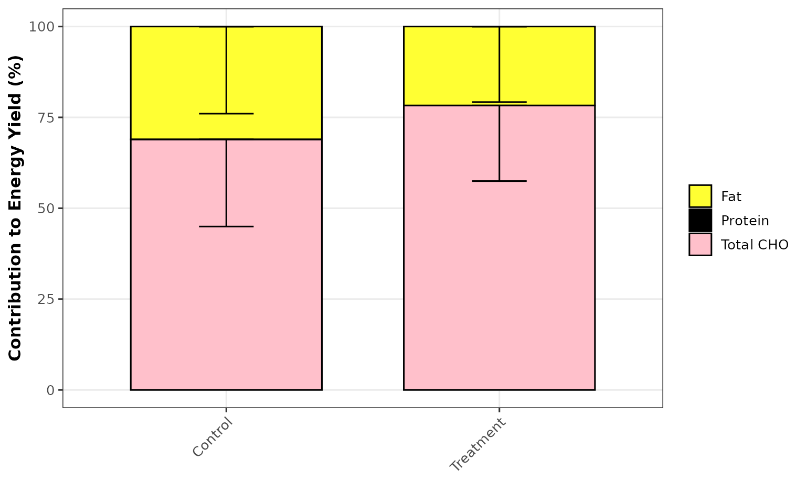

# Complete Analysis Pipeline

## Overview

This vignette documents the complete `oxidizr` analysis pipeline from
raw data import through final reporting. The pipeline consists of six
key stages: 1. **Data Import** - Reading data from files or creating
data objects 2. **Data Validation** - Checking data quality and
physiological plausibility 3. **Steady-State Detection** - Identifying
valid measurement periods 4. **Processing & Aggregation** - Filtering
and summarizing data 5. **Oxidation Computation** - Calculating
substrate oxidation rates 6. **Reporting** - Generating visualizations,
tables, and reports

    #> 
    #> ┌──────────────────────────────────────────────────────────────────┐
    #> │                      oxidizr Analysis Pipeline                    │
    #> ├──────────────────────────────────────────────────────────────────┤
    #> │                                                                   │
    #> │  ┌─────────────┐    ┌─────────────┐    ┌─────────────────────┐  │
    #> │  │ Data Import │───>│  Validation │───>│ Steady-State        │  │
    #> │  │             │    │             │    │ Detection           │  │
    #> │  └─────────────┘    └─────────────┘    └─────────────────────┘  │
    #> │         │                  │                      │              │
    #> │         v                  v                      v              │
    #> │  ┌─────────────┐    ┌─────────────┐    ┌─────────────────────┐  │
    #> │  │ Processing  │<───│  Filtering  │<───│ Quality Report      │  │
    #> │  │ Aggregation │    │  Time Range │    │                     │  │
    #> │  └─────────────┘    └─────────────┘    └─────────────────────┘  │
    #> │         │                                                        │
    #> │         v                                                        │
    #> │  ┌─────────────────────────────────────────────────────────────┐│
    #> │  │              Oxidation Computation                           ││
    #> │  │  calc_substrate_oxidation() → calc_energy_yield()           ││
    #> │  │  [Optional: calc_exogenous_cho() → calc_cho_partition()]    ││
    #> │  └─────────────────────────────────────────────────────────────┘│
    #> │         │                                                        │
    #> │         v                                                        │
    #> │  ┌─────────────────────────────────────────────────────────────┐│
    #> │  │              Reporting & Visualization                       ││
    #> │  │  Plots (ggplot2) │ Tables (gt) │ Reports (Quarto)           ││
    #> │  └─────────────────────────────────────────────────────────────┘│
    #> │                                                                   │
    #> └──────────────────────────────────────────────────────────────────┘

## Quick Start

For those who want to get started immediately, here’s the minimal
workflow:

``` r
library(oxidizr)

# 1. Create or import data
calo <- CalorimetryData(data = my_data)

# 2. Create study object
study <- oxidation_study(calorimetry = calo)

# 3. Run complete analysis (includes validation)
results <- analyze_oxidation(study, validate = TRUE)

# 4. Generate report
render_oxidation_report(results)
```

------------------------------------------------------------------------

## Stage 1: Data Import

### Creating Data Objects

The `oxidizr` package uses S7 classes to organize different types of
data. The primary data types are:

| Class             | Purpose                           | Required Data                   |
|-------------------|-----------------------------------|---------------------------------|
| `CalorimetryData` | Indirect calorimetry measurements | VO₂, VCO₂, subject ID, time     |
| `IsotopeData`     | ¹³C isotope enrichment data       | R_exp, R_exo, R_ref             |
| `UreaData`        | Nitrogen excretion data           | Sweat/urine urea concentrations |
| `EnvironmentData` | Environmental conditions          | Temperature, humidity           |
| `SubjectData`     | Participant characteristics       | Body mass, VO₂max               |
| `OxidationStudy`  | Container for all study data      | CalorimetryData (required)      |

### From Data Frames

``` r
library(oxidizr)
library(dplyr)

# Simulated calorimetry data
set.seed(42)
calo_df <- tibble(
  id = rep(1:5, each = 8),
  protocol = rep(rep(c("Control", "Treatment"), each = 4), 5),
  time = rep(c(30, 60, 90, 120), 10),
  vo2 = 2.5 + rnorm(40, 0, 0.15),
  vco2 = 2.3 + rnorm(40, 0, 0.12)
) |>
  mutate(rer = vco2 / vo2)

# Create CalorimetryData object
calo <- CalorimetryData(
  data = calo_df,
  id_col = "id",
  time_col = "time",
  vo2_col = "vo2",
  vco2_col = "vco2",
  vo2_unit = "L/min",
  protocol_col = "protocol"
)

print(calo)
```

### From Files

``` r
# From CSV
calo <- read_cosmed_csv("path/to/calorimetry.csv")

# From Excel
calo <- read_calorimetry_xlsx("path/to/calorimetry.xlsx")

# From Parvo Medics
calo <- read_parvo("path/to/parvo_export.txt")
```

### Creating a Complete Study

``` r
# For this example, we'll create a study with just calorimetry data
study <- oxidation_study(calorimetry = calo)

print(study)
```

------------------------------------------------------------------------

## Stage 2: Data Validation

Data validation is critical for ensuring physiologically plausible
results. The `oxidizr` validation system checks:

- **Range validation**: Values within physiological limits
- **Missing data**: Completeness assessment
- **Outlier detection**: Statistical outliers using IQR method
- **Consistency**: Cross-dataset alignment (IDs, time points)

### Default Thresholds

The package includes literature-based thresholds for common variables:

``` r
# View calorimetry thresholds
str(calorimetry_thresholds)
#> List of 6
#>  $ vo2              :List of 6
#>   ..$ min        : num 0.2
#>   ..$ max        : num 6
#>   ..$ typical_min: num 0.8
#>   ..$ typical_max: num 4.5
#>   ..$ unit       : chr "L/min"
#>   ..$ reference  : chr "Astrand & Rodahl, 2003"
#>  $ vco2             :List of 6
#>   ..$ min        : num 0.15
#>   ..$ max        : num 5.5
#>   ..$ typical_min: num 0.7
#>   ..$ typical_max: num 4
#>   ..$ unit       : chr "L/min"
#>   ..$ reference  : chr "Astrand & Rodahl, 2003"
#>  $ rer              :List of 6
#>   ..$ min         : num 0.7
#>   ..$ max         : num 1.1
#>   ..$ warning_low : num 0.75
#>   ..$ warning_high: num 1.05
#>   ..$ unit        : chr "ratio"
#>   ..$ reference   : chr "Brooks & Mercier, 1994"
#>  $ cho_oxidation    :List of 5
#>   ..$ min         : num 0
#>   ..$ max         : num 5
#>   ..$ warning_high: num 3.5
#>   ..$ unit        : chr "g/min"
#>   ..$ reference   : chr "Jeukendrup, 2004"
#>  $ fat_oxidation    :List of 5
#>   ..$ min         : num 0
#>   ..$ max         : num 1.5
#>   ..$ warning_high: num 1.2
#>   ..$ unit        : chr "g/min"
#>   ..$ reference   : chr "Achten & Jeukendrup, 2004"
#>  $ protein_oxidation:List of 5
#>   ..$ min         : num 0
#>   ..$ max         : num 0.5
#>   ..$ warning_high: num 0.3
#>   ..$ unit        : chr "g/min"
#>   ..$ reference   : chr "Tarnopolsky, 2004"
```

### Running Validation

``` r
# Validate the complete study
validation <- validate_study(study, verbose = TRUE)

# View results
print(validation)
```

### Validation Output

The `ValidationResult` object contains:

``` r
# Summary of issues by category
summary(validation)
#> # A tibble: 1 × 5
#>   category    severity n_issues n_affected variables     
#>   <chr>       <chr>       <int>      <int> <chr>         
#> 1 calorimetry warning         3          6 rer, vo2, vco2

# Access raw issues
get_data(validation, what = "issues") |>
  head()
#> # A tibble: 3 × 12
#>   check_id         category    variable severity message n_affected pct_affected
#>   <chr>            <chr>       <chr>    <chr>    <glue>       <int>        <dbl>
#> 1 rer_warning_high calorimetry rer      warning  RER va…          4         10  
#> 2 vo2_outliers     calorimetry vo2      warning  Statis…          1          2.5
#> 3 vco2_outliers    calorimetry vco2     warning  Statis…          1          2.5
#> # ℹ 5 more variables: subject_ids <list>, time_points <list>, values <list>,
#> #   threshold <glue>, reference <chr>

# Get recommendations
get_data(validation, what = "recommendations")
#> NULL
```

### Visualizing Data Quality

``` r
# Multi-panel quality dashboard
if (nrow(validation@issues) > 0) {
  plot_data_quality(validation)
}
```



``` r
# Missing data heatmap
plot_missing_data(calo, type = "bar")
```



### Custom Thresholds

You can customize validation thresholds for your specific population:

``` r
# Custom thresholds for high-intensity exercise
custom_thresholds <- list(
  vo2 = list(min = 1.0, max = 7.0, typical_min = 2.0, typical_max = 6.0),
  vco2 = list(min = 0.8, max = 7.0, typical_min = 1.8, typical_max = 5.5),
  rer = list(min = 0.70, max = 1.20, warning_low = 0.75, warning_high = 1.10)
)

validation <- validate_study(study, thresholds = custom_thresholds)
```

------------------------------------------------------------------------

## Stage 3: Steady-State Detection

Reliable oxidation calculations require steady-state conditions. The
package provides two methods for detecting steady-state:

### Coefficient of Variation (CV) Method

Based on Robergs et al. (2010), this method identifies periods where CV
falls below a threshold:

``` r
# Detect steady-state using CV method
ss_cv <- detect_steady_state_cv(
  calo,
  variable = "vo2",
  cv_threshold = 0.10,   # 10% CV threshold
  window_size = 3,        # 3-point rolling window
  min_duration = 2        # Minimum 2 consecutive points
)

head(ss_cv)
#> # A tibble: 6 × 7
#>      id  time   vo2      cv is_steady steady_period meets_duration
#>   <int> <dbl> <dbl>   <dbl> <lgl>             <int> <lgl>         
#> 1     1    30  2.71 NA      FALSE                 0 FALSE         
#> 2     1    30  2.56 NA      FALSE                 0 FALSE         
#> 3     1    60  2.42  0.0567 TRUE                  1 TRUE          
#> 4     1    60  2.48  0.0292 TRUE                  1 TRUE          
#> 5     1    90  2.55  0.0280 TRUE                  1 TRUE          
#> 6     1    90  2.73  0.0482 TRUE                  1 TRUE
```

### Rolling Variance Method

This method uses rolling variance to detect stable periods:

``` r
# Detect using variance method
ss_var <- detect_steady_state_variance(
  calo,
  variable = "vo2",
  window_size = 5
)
```

### Combined Detection

For robustness, combine both methods:

``` r
# Combined detection on both VO2 and VCO2
ss_result <- detect_steady_state(
  calo,
  variables = c("vo2", "vco2"),
  cv_threshold = 0.10,
  method = "both",          # Use both CV and variance
  combine_method = "and",   # Both must agree
  verbose = FALSE
)

# View steady-state summary
tbl_steady_state(ss_result)
```

| Steady-State Detection Summary                              |              |               |            |         |
|-------------------------------------------------------------|--------------|---------------|------------|---------|
| Method: both \| CV threshold: 10% \| Min duration: 2 points |              |               |            |         |
| Subject                                                     | Observations | Steady Points | Steady (%) | Periods |
| 1                                                           | 128          | 0             | 0.00       | 0       |
| 2                                                           | 128          | 0             | 0.00       | 0       |
| 3                                                           | 128          | 0             | 0.00       | 0       |
| 4                                                           | 128          | 0             | 0.00       | 0       |
| 5                                                           | 128          | 0             | 0.00       | 0       |
| Overall: 0% of data in steady-state                         |              |               |            |         |

### Visualizing Steady-State

``` r
plot_steady_state(ss_result)
```



### Filtering to Steady-State Data

``` r
# Get only steady-state observations
ss_data <- filter_steady_state(calo, ss_result)

# Calculate statistics during steady-state
ss_stats <- calc_steady_state_stats(calo, ss_result, variables = c("vo2", "vco2"))
print(ss_stats)
#> # A tibble: 0 × 0
```

------------------------------------------------------------------------

## Stage 4: Processing & Aggregation

### Time Filtering

Often you’ll want to analyze only a specific portion of the exercise:

``` r
# Filter to specific time range (e.g., last hour of exercise)
calo_filtered <- filter_time_range(calo, time_range = c(60, 120))

# Check the result
range(calo_filtered@data$time)
#> [1]  60 120
```

### Aggregation

Aggregate data by time point across subjects:

``` r
# Aggregate to mean values per time point
calo_agg <- aggregate_calorimetry(calo)

head(calo_agg@data)
#>   id time  protocol      vo2     vco2
#> 1  1   30   Control 2.705644 2.324720
#> 2  1   30 Treatment 2.560640 2.135806
#> 3  1   60   Control 2.415295 2.256673
#> 4  1   60 Treatment 2.484081 2.351938
#> 5  1   90   Control 2.554469 2.390980
#> 6  1   90 Treatment 2.726728 2.202633
```

------------------------------------------------------------------------

## Stage 5: Oxidation Computation

### Basic Substrate Oxidation

Calculate carbohydrate and fat oxidation using stoichiometric equations:

``` r
# Calculate substrate oxidation
oxidation <- calc_substrate_oxidation(calo)

# View results
oxidation |>
  select(id, time, cho_total, fat_total, rer) |>
  head(10)
#> # A tibble: 10 × 5
#>       id  time cho_total fat_total   rer
#>    <int> <dbl>     <dbl>     <dbl> <dbl>
#>  1     1    30      1.86    0.652  0.859
#>  2     1    60      2.50    0.272  0.934
#>  3     1    90      2.67    0.280  0.936
#>  4     1   120      1.71    0.654  0.853
#>  5     1    30      1.47    0.727  0.834
#>  6     1    60      2.72    0.226  0.947
#>  7     1    90      1.23    0.897  0.808
#>  8     1   120      3.27    0.0214 0.995
#>  9     2    30      1.19    0.949  0.802
#> 10     2    60      2.82    0.192  0.955
```

### Energy Contributions

Convert oxidation rates to energy yield:

``` r
# Calculate energy yield (kcal/min)
energy <- calc_energy_yield(oxidation)

# Calculate percentage contributions
energy <- calc_energy_percent(energy)

energy |>
  select(id, time, e_total, pct_cho_total, pct_fat) |>
  head()
#> # A tibble: 6 × 5
#>      id  time e_total pct_cho_total pct_fat
#>   <int> <dbl>   <dbl>         <dbl>   <dbl>
#> 1     1    30    13.1          53.0    47.0
#> 2     1    60    11.9          78.4    21.6
#> 3     1    90    12.6          79.0    21.0
#> 4     1   120    12.5          50.7    49.3
#> 5     1    30    12.3          44.3    55.7
#> 6     1    60    12.2          82.6    17.4
```

### Complete Analysis with analyze_oxidation()

The
[`analyze_oxidation()`](https://jotremblay.github.io/oxidizr/reference/analyze_oxidation.md)
function performs the complete workflow:

``` r
# Complete analysis (validation + computation)
results <- analyze_oxidation(
  study,
  time_range = c(30, 120),    # Filter time range
  aggregate = FALSE,           # Keep individual observations
  calc_energy = TRUE,          # Calculate energy contributions
  validate = TRUE,             # Run validation first
  strict = FALSE               # Warn but don't stop on issues
)

print(results)
```

### Accessing Results

``` r
# Get oxidation rates
rates <- get_data(results, what = "rates")
head(rates)
#> # A tibble: 6 × 10
#>      id  time protocol  cho_total fat_total protein_ox   rer rer_np vo2_lmin
#>   <int> <dbl> <chr>         <dbl>     <dbl>      <dbl> <dbl>  <dbl>    <dbl>
#> 1     1    30 Control        1.86     0.652          0 0.859  0.859     2.71
#> 2     1    60 Control        2.50     0.272          0 0.934  0.934     2.42
#> 3     1    90 Control        2.67     0.280          0 0.936  0.936     2.55
#> 4     1   120 Control        1.71     0.654          0 0.853  0.853     2.59
#> 5     1    30 Treatment      1.47     0.727          0 0.834  0.834     2.56
#> 6     1    60 Treatment      2.72     0.226          0 0.947  0.947     2.48
#> # ℹ 1 more variable: vco2_lmin <dbl>

# Get energy contributions
energy_df <- get_data(results, what = "energy")
head(energy_df)
#> # A tibble: 6 × 17
#>      id  time protocol  cho_total fat_total protein_ox   rer rer_np vo2_lmin
#>   <int> <dbl> <chr>         <dbl>     <dbl>      <dbl> <dbl>  <dbl>    <dbl>
#> 1     1    30 Control        1.86     0.652          0 0.859  0.859     2.71
#> 2     1    60 Control        2.50     0.272          0 0.934  0.934     2.42
#> 3     1    90 Control        2.67     0.280          0 0.936  0.936     2.55
#> 4     1   120 Control        1.71     0.654          0 0.853  0.853     2.59
#> 5     1    30 Treatment      1.47     0.727          0 0.834  0.834     2.56
#> 6     1    60 Treatment      2.72     0.226          0 0.947  0.947     2.48
#> # ℹ 8 more variables: vco2_lmin <dbl>, e_cho_total <dbl>, e_fat <dbl>,
#> #   e_protein <dbl>, e_total <dbl>, pct_cho_total <dbl>, pct_fat <dbl>,
#> #   pct_protein <dbl>

# Summary statistics
summary(results, by = "protocol")
#> # A tibble: 2 × 6
#>   protocol  cho_total_mean cho_total_sd fat_total_mean fat_total_sd     n
#>   <chr>              <dbl>        <dbl>          <dbl>        <dbl> <int>
#> 1 Control             2.36        0.866          0.421        0.340    20
#> 2 Treatment           2.62        0.712          0.288        0.278    20
```

------------------------------------------------------------------------

## Stage 6: Reporting

### Visualizations

#### Time Course Plots

``` r
# Oxidation time course by protocol
plot_oxidation_timecourse(results, substrate = "all", by = "protocol")
```



``` r
# RER time course
plot_rer_timecourse(results, by = "protocol")
```



#### Energy Contributions

``` r
# Stacked bar chart of energy contributions
plot_energy_contribution(results, by = "protocol")
```



### Tables

#### Oxidation Summary

``` r
tbl_oxidation_summary(results, by = "protocol")
```

| **protocol** | **n** | Total CHO (g/min) | Fat (g/min) | Protein (g/min) |
|--------------|-------|-------------------|-------------|-----------------|
| Control      | 20    | 2.36 ± 0.87       | 0.42 ± 0.34 | 0.00 ± 0.00     |
| Treatment    | 20    | 2.62 ± 0.71       | 0.29 ± 0.28 | 0.00 ± 0.00     |

#### Energy Contributions

``` r
tbl_energy_contribution(results, by = "protocol")
```

| **protocol** | **n** | CHO (kcal/min) | Fat (kcal/min) | Protein (kcal/min) | Total (kcal/min) | CHO (%)     | Fat (%)     | Protein (%) |
|--------------|-------|----------------|----------------|--------------------|------------------|-------------|-------------|-------------|
| Control      | 20    | 8.8 ± 3.2      | 4.0 ± 3.2      | 0.0 ± 0.0          | 12.7 ± 0.9       | 68.9 ± 24.0 | 31.1 ± 24.0 | 0.0 ± 0.0   |
| Treatment    | 20    | 9.7 ± 2.7      | 2.7 ± 2.6      | 0.0 ± 0.0          | 12.5 ± 0.7       | 78.3 ± 20.8 | 21.7 ± 20.8 | 0.0 ± 0.0   |

#### Data Completeness

``` r
tbl_data_completeness(calo, by = "variable")
```

| Data Completeness Report |       |          |         |              |             |
|--------------------------|-------|----------|---------|--------------|-------------|
| Threshold: 95% complete  |       |          |         |              |             |
| Variable                 | Total | Complete | Missing | Complete (%) | Missing (%) |
| vo2                      | 40    | 40       | 0       | 100.0        | 0.0         |
| vco2                     | 40    | 40       | 0       | 100.0        | 0.0         |
| rer                      | 40    | 40       | 0       | 100.0        | 0.0         |

### Automated Reports

#### Quality Report

Generate a comprehensive data quality report:

``` r
# Generate HTML quality report
render_quality_report(
  study,
  output_file = "quality_report.html",
  include_steady_state = TRUE,
  include_recommendations = TRUE
)
```

#### Analysis Report

Generate a complete analysis report:

``` r
# Generate HTML analysis report
render_oxidation_report(
  results,
  output_file = "oxidation_report.html",
  title = "Substrate Oxidation Analysis",
  include_stats = TRUE,
  include_tables = TRUE
)
```

------------------------------------------------------------------------

## Complete Workflow Example

Here’s a complete end-to-end example:

``` r
library(oxidizr)

# ============================================
# STAGE 1: DATA IMPORT
# ============================================

# Read calorimetry data
calo <- read_cosmed_csv("data/calorimetry.csv")

# Read subject data
subjects <- SubjectData(data = read.csv("data/subjects.csv"))

# Create study
study <- oxidation_study(
  calorimetry = calo,
  subjects = subjects
)

# ============================================
# STAGE 2: DATA VALIDATION
# ============================================

# Validate and generate quality report
validation <- validate_study(study)
print(validation)

# Generate quality report if issues found
if (!validation@passed) {
  render_quality_report(study, validation = validation)
}

# ============================================
# STAGE 3: STEADY-STATE DETECTION
# ============================================

# Detect steady-state periods
ss_result <- detect_steady_state(
  calo,
  variables = c("vo2", "vco2"),
  cv_threshold = 0.10,
  method = "both"
)

# Filter to steady-state only
calo_ss <- filter_steady_state(calo, ss_result)

# ============================================
# STAGE 4: PROCESSING
# ============================================

# Update study with filtered data
study_ss <- oxidation_study(
  calorimetry = calo_ss,
  subjects = subjects
)

# ============================================
# STAGE 5: OXIDATION COMPUTATION
# ============================================

# Run complete analysis
results <- analyze_oxidation(
  study_ss,
  time_range = c(30, 120),
  calc_energy = TRUE,
  validate = FALSE  # Already validated
)

# ============================================
# STAGE 6: REPORTING
# ============================================

# Generate final report
render_oxidation_report(results, output_file = "final_report.html")

# Export tables to Excel
export_table_xlsx(
  tbl_oxidation_summary(results),
  file = "oxidation_summary.xlsx"
)

# Save figures
ggsave(
  "oxidation_timecourse.png",
  plot_oxidation_timecourse(results),
  width = 10, height = 6
)
```

------------------------------------------------------------------------

## Best Practices

### 1. Always Validate First

``` r
# Run validation before any analysis
validation <- validate_study(study)
if (!validation@passed) {
  # Review issues before proceeding
  print(validation)
  plot_data_quality(validation)
}
```

### 2. Check Steady-State

``` r
# Verify data is in steady-state before oxidation calculations
ss <- detect_steady_state(calo, variables = c("vo2", "vco2"))
tbl_steady_state(ss)  # Review % in steady-state
```

### 3. Document Your Thresholds

``` r
# Save custom thresholds for reproducibility
my_thresholds <- list(
  vo2 = list(min = 0.5, max = 5.0),
  rer = list(min = 0.70, max = 1.10)
)
saveRDS(my_thresholds, "analysis_thresholds.rds")
```

### 4. Use Reproducible Workflows

Consider using the `targets` package for reproducible pipelines:

``` r
# See vignette("targets-workflow") for details
library(targets)
tar_make()
```

------------------------------------------------------------------------

## Summary

The `oxidizr` pipeline provides a complete, validated workflow for
substrate oxidation analysis:

| Stage        | Key Functions                                                                                                                                                                                      | Output                |
|--------------|----------------------------------------------------------------------------------------------------------------------------------------------------------------------------------------------------|-----------------------|
| Import       | [`CalorimetryData()`](https://jotremblay.github.io/oxidizr/reference/CalorimetryData.md), `read_*()`                                                                                               | S7 data objects       |
| Validation   | [`validate_study()`](https://jotremblay.github.io/oxidizr/reference/validate_study.md), [`validate_calorimetry()`](https://jotremblay.github.io/oxidizr/reference/validate_calorimetry.md)         | `ValidationResult`    |
| Steady-State | [`detect_steady_state()`](https://jotremblay.github.io/oxidizr/reference/detect_steady_state.md)                                                                                                   | Filtered data         |
| Processing   | [`filter_time_range()`](https://jotremblay.github.io/oxidizr/reference/filter_time_range.md), [`aggregate_calorimetry()`](https://jotremblay.github.io/oxidizr/reference/aggregate_calorimetry.md) | Processed data        |
| Computation  | [`analyze_oxidation()`](https://jotremblay.github.io/oxidizr/reference/analyze_oxidation.md), `calc_*()`                                                                                           | `OxidationResults`    |
| Reporting    | `plot_*()`, `tbl_*()`, `render_*_report()`                                                                                                                                                         | Figures, tables, HTML |

## Session Info

``` r
sessionInfo()
#> R version 4.5.2 (2025-10-31)
#> Platform: x86_64-pc-linux-gnu
#> Running under: Ubuntu 24.04.3 LTS
#> 
#> Matrix products: default
#> BLAS:   /usr/lib/x86_64-linux-gnu/openblas-pthread/libblas.so.3 
#> LAPACK: /usr/lib/x86_64-linux-gnu/openblas-pthread/libopenblasp-r0.3.26.so;  LAPACK version 3.12.0
#> 
#> locale:
#>  [1] LC_CTYPE=C.UTF-8       LC_NUMERIC=C           LC_TIME=C.UTF-8       
#>  [4] LC_COLLATE=C.UTF-8     LC_MONETARY=C.UTF-8    LC_MESSAGES=C.UTF-8   
#>  [7] LC_PAPER=C.UTF-8       LC_NAME=C              LC_ADDRESS=C          
#> [10] LC_TELEPHONE=C         LC_MEASUREMENT=C.UTF-8 LC_IDENTIFICATION=C   
#> 
#> time zone: UTC
#> tzcode source: system (glibc)
#> 
#> attached base packages:
#> [1] stats     graphics  grDevices utils     datasets  methods   base     
#> 
#> other attached packages:
#> [1] dplyr_1.1.4   oxidizr_0.1.0
#> 
#> loaded via a namespace (and not attached):
#>  [1] gt_1.1.0           sass_0.4.10        utf8_1.2.6         generics_0.1.4    
#>  [5] tidyr_1.3.1        xml2_1.5.1         stringi_1.8.7      digest_0.6.39     
#>  [9] magrittr_2.0.4     evaluate_1.0.5     grid_4.5.2         RColorBrewer_1.1-3
#> [13] fastmap_1.2.0      jsonlite_2.0.0     slider_0.3.3       purrr_1.2.0       
#> [17] scales_1.4.0       textshaping_1.0.4  jquerylib_0.1.4    cli_3.6.5         
#> [21] rlang_1.1.6        litedown_0.8       commonmark_2.0.0   withr_3.0.2       
#> [25] cachem_1.1.0       yaml_2.3.11        tools_4.5.2        ggplot2_4.0.1     
#> [29] forcats_1.0.1      vctrs_0.6.5        R6_2.6.1           lifecycle_1.0.4   
#> [33] stringr_1.6.0      fs_1.6.6           htmlwidgets_1.6.4  ragg_1.5.0        
#> [37] pkgconfig_2.0.3    desc_1.4.3         warp_0.2.2         pkgdown_2.2.0     
#> [41] pillar_1.11.1      bslib_0.9.0        gtable_0.3.6       glue_1.8.0        
#> [45] systemfonts_1.3.1  xfun_0.54          tibble_3.3.0       tidyselect_1.2.1  
#> [49] knitr_1.50         farver_2.1.2       htmltools_0.5.9    patchwork_1.3.2   
#> [53] rmarkdown_2.30     labeling_0.4.3     compiler_4.5.2     S7_0.2.1          
#> [57] markdown_2.0
```
