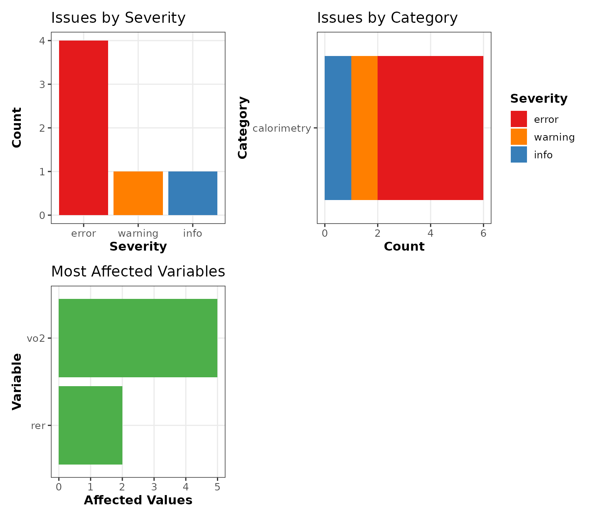
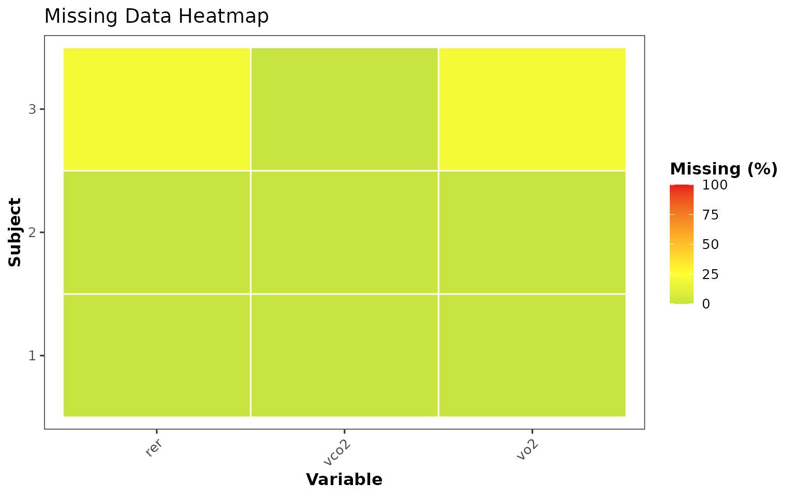
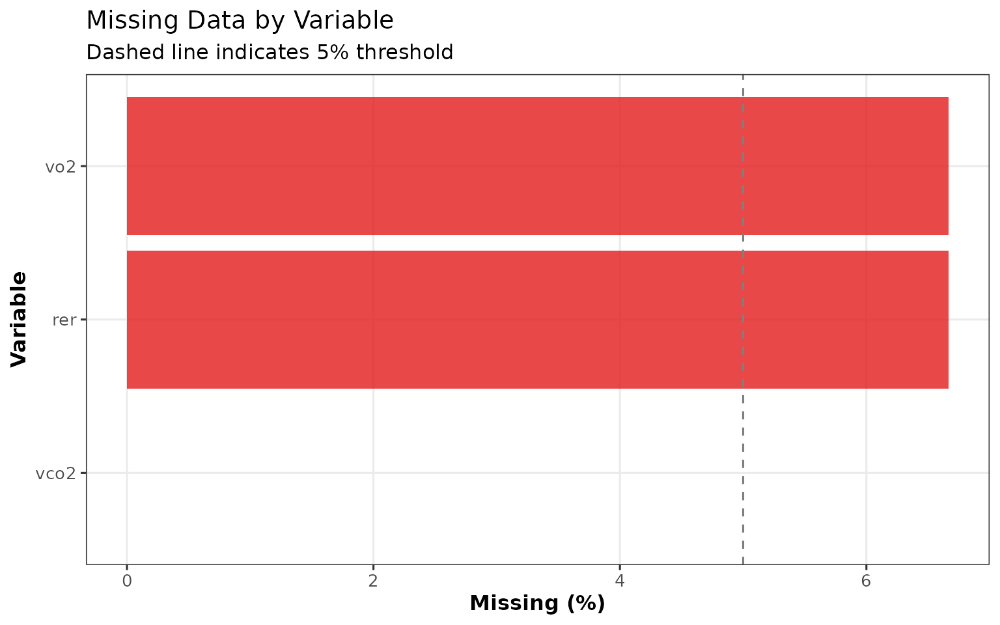
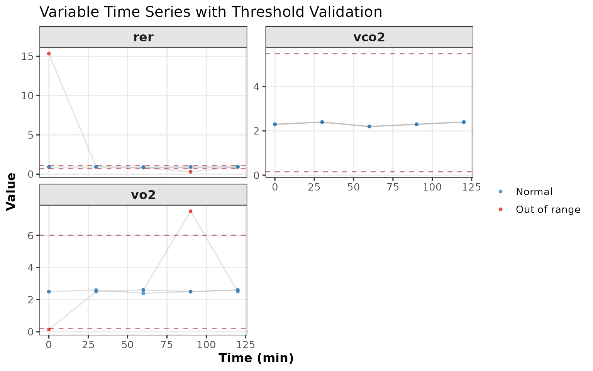
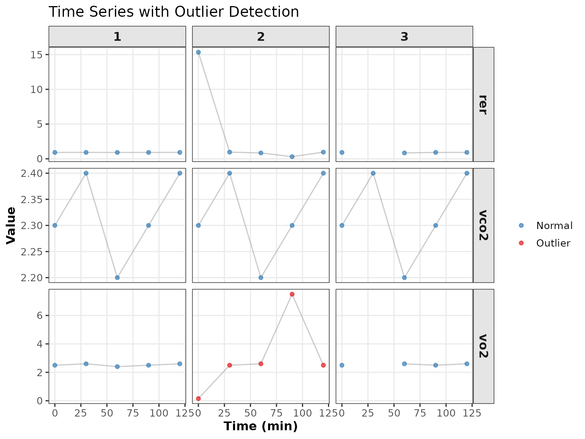
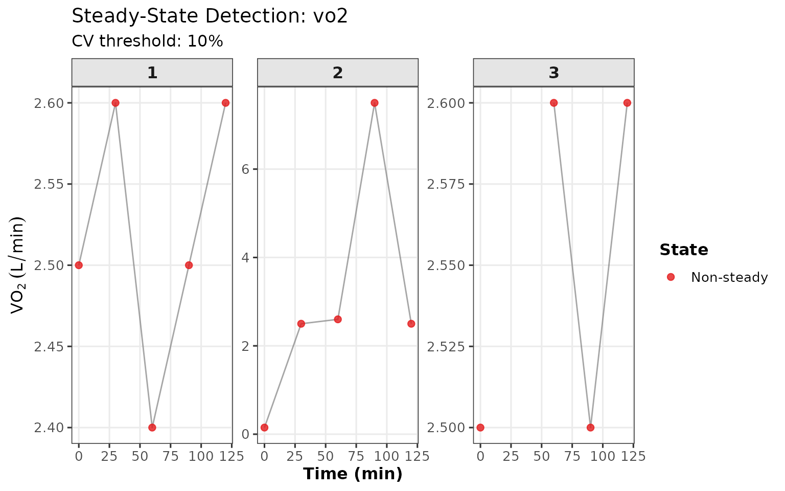

# Data Validation & Quality Control

## Introduction

Data quality is fundamental to reliable substrate oxidation analysis.
The `oxidizr` package provides comprehensive validation tools to:

- Verify data types and structure
- Check values are within physiological ranges
- Detect outliers and missing data
- Identify steady-state periods
- Generate quality reports

This vignette covers all validation features in detail.

``` r
library(oxidizr)
library(dplyr)
```

## The Validation Framework

### ValidationResult Class

All validation functions return a `ValidationResult` S7 object
containing:

| Property           | Description                          |
|--------------------|--------------------------------------|
| `issues`           | Tibble of all detected issues        |
| `passed`           | TRUE if no errors (warnings allowed) |
| `severity_summary` | Counts by severity level             |
| `data_summary`     | Completeness metrics                 |
| `recommendations`  | Suggested actions                    |
| `timestamp`        | When validation was performed        |

### Severity Levels

Issues are categorized by severity:

- **error**: Critical issues that may invalidate results
- **warning**: Potential problems worth investigating
- **info**: Informational notes

## Validation Functions

### validate_study()

The main entry point for comprehensive validation:

``` r
# Create sample data with some issues
set.seed(42)
df <- tibble(
  id = rep(1:3, each = 5),
  time = rep(c(0, 30, 60, 90, 120), 3),
  vo2 = c(2.5, 2.6, 2.4, 2.5, 2.6,
          0.15, 2.5, 2.6, 7.5, 2.5,  # Subject 2: out of range
          2.5, NA, 2.6, 2.5, 2.6),    # Subject 3: missing
  vco2 = c(2.3, 2.4, 2.2, 2.3, 2.4,
           2.3, 2.4, 2.2, 2.3, 2.4,
           2.3, 2.4, 2.2, 2.3, 2.4)
) |>
  mutate(rer = vco2 / vo2)

calo <- CalorimetryData(data = df)
study <- oxidation_study(calorimetry = calo)

# Validate
validation <- validate_study(study, verbose = TRUE)
```

### validate_calorimetry()

Focused validation of calorimetry data:

``` r
validation_calo <- validate_calorimetry(calo)
print(validation_calo)
```

### Component Validators

Specialized validators for each data type:

``` r
# Isotope data
validation_iso <- validate_isotopes(isotope_data)

# Environment data
validation_env <- validate_environment(environment_data)

# Urea data
validation_urea <- validate_urea(urea_data)

# Cross-dataset consistency
validation_consistency <- check_consistency(study)
```

## Physiological Thresholds

### Default Thresholds

The package includes evidence-based thresholds:

``` r
# Calorimetry thresholds
cat("Calorimetry Thresholds:\n")
#> Calorimetry Thresholds:
str(calorimetry_thresholds, max.level = 2)
#> List of 6
#>  $ vo2              :List of 6
#>   ..$ min        : num 0.2
#>   ..$ max        : num 6
#>   ..$ typical_min: num 0.8
#>   ..$ typical_max: num 4.5
#>   ..$ unit       : chr "L/min"
#>   ..$ reference  : chr "Astrand & Rodahl, 2003"
#>  $ vco2             :List of 6
#>   ..$ min        : num 0.15
#>   ..$ max        : num 5.5
#>   ..$ typical_min: num 0.7
#>   ..$ typical_max: num 4
#>   ..$ unit       : chr "L/min"
#>   ..$ reference  : chr "Astrand & Rodahl, 2003"
#>  $ rer              :List of 6
#>   ..$ min         : num 0.7
#>   ..$ max         : num 1.1
#>   ..$ warning_low : num 0.75
#>   ..$ warning_high: num 1.05
#>   ..$ unit        : chr "ratio"
#>   ..$ reference   : chr "Brooks & Mercier, 1994"
#>  $ cho_oxidation    :List of 5
#>   ..$ min         : num 0
#>   ..$ max         : num 5
#>   ..$ warning_high: num 3.5
#>   ..$ unit        : chr "g/min"
#>   ..$ reference   : chr "Jeukendrup, 2004"
#>  $ fat_oxidation    :List of 5
#>   ..$ min         : num 0
#>   ..$ max         : num 1.5
#>   ..$ warning_high: num 1.2
#>   ..$ unit        : chr "g/min"
#>   ..$ reference   : chr "Achten & Jeukendrup, 2004"
#>  $ protein_oxidation:List of 5
#>   ..$ min         : num 0
#>   ..$ max         : num 0.5
#>   ..$ warning_high: num 0.3
#>   ..$ unit        : chr "g/min"
#>   ..$ reference   : chr "Tarnopolsky, 2004"
```

``` r
# Isotope thresholds
cat("\nIsotope Thresholds:\n")
#> 
#> Isotope Thresholds:
str(isotope_thresholds, max.level = 2)
#> List of 4
#>  $ rexp:List of 4
#>   ..$ min      : num -35
#>   ..$ max      : num 100
#>   ..$ unit     : chr "delta per mil"
#>   ..$ reference: chr "Craig, 1957; Pirnay et al., 1977"
#>  $ rexo:List of 4
#>   ..$ min      : num -30
#>   ..$ max      : num 200
#>   ..$ unit     : chr "delta per mil"
#>   ..$ reference: chr "Lefebvre, 1985"
#>  $ rref:List of 4
#>   ..$ min      : num -35
#>   ..$ max      : num -15
#>   ..$ unit     : chr "delta per mil"
#>   ..$ reference: chr "Pirnay et al., 1977"
#>  $ rpla:List of 4
#>   ..$ min      : num -30
#>   ..$ max      : num 100
#>   ..$ unit     : chr "delta per mil"
#>   ..$ reference: chr "Mosora et al., 1976"
```

### Threshold Fields

Each threshold list contains:

| Field          | Description                            |
|----------------|----------------------------------------|
| `min`          | Absolute minimum (error if below)      |
| `max`          | Absolute maximum (error if above)      |
| `typical_min`  | Typical lower bound (warning if below) |
| `typical_max`  | Typical upper bound (warning if above) |
| `warning_low`  | Warning threshold (low)                |
| `warning_high` | Warning threshold (high)               |
| `unit`         | Measurement unit                       |

### Custom Thresholds

Override defaults for your specific context:

``` r
# Custom thresholds for elite athletes
elite_thresholds <- list(
  vo2 = list(
    min = 1.0,
    max = 7.0,
    typical_min = 2.5,
    typical_max = 6.5,
    unit = "L/min"
  ),
  vco2 = list(
    min = 0.8,
    max = 7.5,
    typical_min = 2.2,
    typical_max = 6.0,
    unit = "L/min"
  ),
  rer = list(
    min = 0.70,
    max = 1.25,  # Allow higher for max efforts
    warning_low = 0.75,
    warning_high = 1.15
  )
)

# Use custom thresholds
validation_elite <- validate_calorimetry(calo, thresholds = elite_thresholds)
```

## Working with Validation Results

### Accessing Issues

``` r
# Get issues as tibble
issues <- get_data(validation, what = "issues")

# Filter by severity
errors <- issues |> filter(severity == "error")
warnings <- issues |> filter(severity == "warning")

# Filter by category
range_issues <- issues |> filter(category == "range")
```

### Summary Statistics

``` r
# Summary by category
summary(validation)
#> # A tibble: 3 × 5
#>   category    severity n_issues n_affected variables
#>   <chr>       <chr>       <int>      <int> <chr>    
#> 1 calorimetry error           4          4 vo2, rer 
#> 2 calorimetry warning         1          2 vo2      
#> 3 calorimetry info            1          1 vo2
```

### Recommendations

``` r
# Get recommendations
recs <- get_data(validation, what = "recommendations")
if (!is.null(recs) && nrow(recs) > 0) {
  print(recs)
}
#> # A tibble: 4 × 1
#>   recommendation                                                                
#>   <chr>                                                                         
#> 1 Review VO2 values below minimum - may indicate measurement errors or data ent…
#> 2 Review VO2 values above maximum - check units and equipment calibration       
#> 3 RER below 0.70 indicates measurement error - check gas analyzer calibration   
#> 4 RER above 1.10 indicates hyperventilation or measurement error
```

## Visualization

### Quality Dashboard

``` r
if (nrow(validation@issues) > 0) {
  plot_data_quality(validation)
}
```



### Missing Data Patterns

``` r
# Heatmap of missing data
plot_missing_data(calo, type = "heatmap")
```



``` r
# Bar plot of missing by variable
plot_missing_data(calo, type = "bar")
```



### Range Validation

``` r
# Time series with out-of-range highlighted
plot_validation_timeseries(calo)
```



### Outlier Detection

``` r
# Outliers highlighted in time series
plot_outliers(calo, validation)
```



## Quality Tables

### Validation Summary Table

``` r
tbl_validation_summary(validation, group_by = "category")
```

| Validation Summary                           |        |        |          |      |                 |
|----------------------------------------------|--------|--------|----------|------|-----------------|
| Validation Failed (4 error(s), 1 warning(s)) |        |        |          |      |                 |
| Category                                     | Issues | Errors | Warnings | Info | Affected Values |
| calorimetry                                  | 6      | 4      | 1        | 1    | 7               |

### Data Completeness Table

``` r
tbl_data_completeness(calo, by = "variable")
```

| Data Completeness Report |       |          |         |              |             |
|--------------------------|-------|----------|---------|--------------|-------------|
| Threshold: 95% complete  |       |          |         |              |             |
| Variable                 | Total | Complete | Missing | Complete (%) | Missing (%) |
| vo2                      | 15    | 14       | 1       | 93.3         | 6.7         |
| rer                      | 15    | 14       | 1       | 93.3         | 6.7         |
| vco2                     | 15    | 15       | 0       | 100.0        | 0.0         |

### Outlier Table

``` r
tbl_outliers(validation)
```

| Outlier Detection Summary |          |       |            |            |               |                                                   |
|---------------------------|----------|-------|------------|------------|---------------|---------------------------------------------------|
| 1 outlier issue(s) found  |          |       |            |            |               |                                                   |
| Variable                  | Severity | Count | % Affected | Threshold  | Sample Values | Description                                       |
| vo2                       | warning  | 2     | 13.3%      | 1.5 \* IQR | 0.15, 7.5     | Statistical outliers detected in VO2 (IQR method) |

## Steady-State Detection

### Why Steady-State Matters

Substrate oxidation calculations assume steady-state conditions.
Non-steady data can lead to:

- Inaccurate RER values
- Unreliable oxidation estimates
- Increased measurement noise

### CV Threshold Method

Based on Robergs et al. (2010):

``` r
# Coefficient of variation method
ss_cv <- detect_steady_state_cv(
  calo,
  variable = "vo2",
  cv_threshold = 0.10,  # 10% CV
  window_size = 3
)

# View CV values
ss_cv |>
  select(id, time, vo2, cv, is_steady, meets_duration) |>
  head(10)
#> # A tibble: 10 × 6
#>       id  time   vo2      cv is_steady meets_duration
#>    <int> <dbl> <dbl>   <dbl> <lgl>     <lgl>         
#>  1     1     0  2.5  NA      FALSE     FALSE         
#>  2     1    30  2.6  NA      FALSE     FALSE         
#>  3     1    60  2.4   0.0400 TRUE      TRUE          
#>  4     1    90  2.5   0.0400 TRUE      TRUE          
#>  5     1   120  2.6   0.0400 TRUE      TRUE          
#>  6     2     0  0.15 NA      FALSE     FALSE         
#>  7     2    30  2.5  NA      FALSE     FALSE         
#>  8     2    60  2.6   0.792  FALSE     FALSE         
#>  9     2    90  7.5   0.681  FALSE     FALSE         
#> 10     2   120  2.5   0.681  FALSE     FALSE
```

### Rolling Variance Method

``` r
# Variance method (auto threshold)
ss_var <- detect_steady_state_variance(
  calo,
  variable = "vo2",
  window_size = 5
)
```

### Combined Detection

``` r
# Combine both methods for robustness
ss_combined <- detect_steady_state(
  calo,
  variables = c("vo2", "vco2"),
  cv_threshold = 0.10,
  method = "both",
  combine_method = "and",  # Both must agree
  verbose = FALSE
)
```

### Visualizing Steady-State

``` r
plot_steady_state(ss_combined)
```



### Steady-State Summary

``` r
tbl_steady_state(ss_combined)
```

| Steady-State Detection Summary                              |              |               |            |         |
|-------------------------------------------------------------|--------------|---------------|------------|---------|
| Method: both \| CV threshold: 10% \| Min duration: 2 points |              |               |            |         |
| Subject                                                     | Observations | Steady Points | Steady (%) | Periods |
| 1                                                           | 5            | 0             | 0.00       | 0       |
| 2                                                           | 5            | 0             | 0.00       | 0       |
| 3                                                           | 5            | 0             | 0.00       | 0       |
| Overall: 0% of data in steady-state                         |              |               |            |         |

### Filtering to Steady-State

``` r
# Keep only steady-state observations
ss_data <- filter_steady_state(calo, ss_combined)
nrow(ss_data)
#> [1] 0

# Calculate steady-state statistics
ss_stats <- calc_steady_state_stats(
  calo,
  ss_combined,
  variables = c("vo2", "vco2")
)
print(ss_stats)
#> # A tibble: 0 × 0
```

## Generating Quality Reports

### HTML Quality Report

``` r
# Generate comprehensive quality report
render_quality_report(
  study,
  validation = validation,
  output_file = "quality_report.html",
  include_steady_state = TRUE,
  include_recommendations = TRUE
)
```

### Custom Templates

``` r
# Create editable template
create_quality_report_template("my_quality_template.qmd")

# Use custom template
render_quality_report(
  study,
  template = "my_quality_template.qmd",
  output_file = "custom_report.html"
)
```

## Integration with analyze_oxidation()

### Automatic Validation

``` r
# Validation runs automatically by default
results <- analyze_oxidation(
  study,
  validate = TRUE,   # Default: TRUE
  strict = FALSE     # Default: FALSE (warn, don't stop)
)
```

### Strict Mode

``` r
# Stop on validation errors
results <- analyze_oxidation(
  study,
  validate = TRUE,
  strict = TRUE  # Will error if validation fails
)
```

### Accessing Validation from Results

``` r
# Validation is stored in settings
if (!is.null(results@settings$validation)) {
  val <- results@settings$validation
  print(val)
}
```

## Best Practices

### 1. Validate Early

Always validate before analysis:

``` r
validation <- validate_study(study)
if (!validation@passed) {
  # Review and address issues
  render_quality_report(study, validation = validation)
  stop("Fix data issues before proceeding")
}
```

### 2. Document Threshold Decisions

``` r
# Save your thresholds for reproducibility
my_thresholds <- list(
  vo2 = list(min = 0.5, max = 5.0, unit = "L/min"),
  rer = list(min = 0.70, max = 1.10)
)

# Document rationale
comment(my_thresholds) <- "Thresholds for sedentary population, moderate intensity"

saveRDS(my_thresholds, "study_thresholds.rds")
```

### 3. Check Steady-State

``` r
# Always verify steady-state before oxidation calculations
ss <- detect_steady_state(calo, variables = c("vo2", "vco2"))

# Aim for >80% in steady-state
ss_pct <- mean(ss$meets_duration, na.rm = TRUE) * 100
if (ss_pct < 80) {
  warning(sprintf("Only %.1f%% of data in steady-state", ss_pct))
}
```

### 4. Generate Reports

``` r
# Always generate a quality report for documentation
render_quality_report(
  study,
  output_file = sprintf("quality_%s.html", Sys.Date())
)
```

## Troubleshooting Common Issues

### High RER Values (\>1.0)

``` r
# Check for non-steady-state periods
ss <- detect_steady_state(calo)
non_steady <- calo@data[!ss$meets_duration, ]

# Check for hyperventilation artifacts
high_rer <- calo@data |> filter(rer > 1.0)
```

### Missing Data Patterns

``` r
# Investigate missing data
plot_missing_data(calo, type = "upset")

# Check if missingness is random or systematic
missing_by_time <- calo@data |>
  group_by(time) |>
  summarise(pct_missing = mean(is.na(vo2)) * 100)
```

### Outlier Investigation

``` r
# Get outlier details
outliers <- validation@issues |>
  filter(grepl("outlier", check_id)) |>
  pull(subject_ids) |>
  unlist() |>
  unique()

# Review outlier subjects
calo@data |> filter(id %in% outliers)
```

## Session Info

``` r
sessionInfo()
#> R version 4.5.2 (2025-10-31)
#> Platform: x86_64-pc-linux-gnu
#> Running under: Ubuntu 24.04.3 LTS
#> 
#> Matrix products: default
#> BLAS:   /usr/lib/x86_64-linux-gnu/openblas-pthread/libblas.so.3 
#> LAPACK: /usr/lib/x86_64-linux-gnu/openblas-pthread/libopenblasp-r0.3.26.so;  LAPACK version 3.12.0
#> 
#> locale:
#>  [1] LC_CTYPE=C.UTF-8       LC_NUMERIC=C           LC_TIME=C.UTF-8       
#>  [4] LC_COLLATE=C.UTF-8     LC_MONETARY=C.UTF-8    LC_MESSAGES=C.UTF-8   
#>  [7] LC_PAPER=C.UTF-8       LC_NAME=C              LC_ADDRESS=C          
#> [10] LC_TELEPHONE=C         LC_MEASUREMENT=C.UTF-8 LC_IDENTIFICATION=C   
#> 
#> time zone: UTC
#> tzcode source: system (glibc)
#> 
#> attached base packages:
#> [1] stats     graphics  grDevices utils     datasets  methods   base     
#> 
#> other attached packages:
#> [1] dplyr_1.1.4   oxidizr_0.1.0
#> 
#> loaded via a namespace (and not attached):
#>  [1] gtable_0.3.6       jsonlite_2.0.0     compiler_4.5.2     tidyselect_1.2.1  
#>  [5] stringr_1.6.0      xml2_1.5.1         tidyr_1.3.2        jquerylib_0.1.4   
#>  [9] systemfonts_1.3.1  scales_1.4.0       textshaping_1.0.4  yaml_2.3.12       
#> [13] fastmap_1.2.0      ggplot2_4.0.1      R6_2.6.1           labeling_0.4.3    
#> [17] patchwork_1.3.2    generics_0.1.4     warp_0.2.2         knitr_1.51        
#> [21] htmlwidgets_1.6.4  forcats_1.0.1      tibble_3.3.0       desc_1.4.3        
#> [25] bslib_0.9.0        pillar_1.11.1      RColorBrewer_1.1-3 rlang_1.1.6       
#> [29] utf8_1.2.6         stringi_1.8.7      cachem_1.1.0       xfun_0.55         
#> [33] fs_1.6.6           sass_0.4.10        S7_0.2.1           cli_3.6.5         
#> [37] withr_3.0.2        pkgdown_2.2.0      magrittr_2.0.4     digest_0.6.39     
#> [41] grid_4.5.2         slider_0.3.3       lifecycle_1.0.4    vctrs_0.6.5       
#> [45] evaluate_1.0.5     glue_1.8.0         farver_2.1.2       ragg_1.5.0        
#> [49] gt_1.2.0           rmarkdown_2.30     purrr_1.2.0        tools_4.5.2       
#> [53] pkgconfig_2.0.3    htmltools_0.5.9
```
